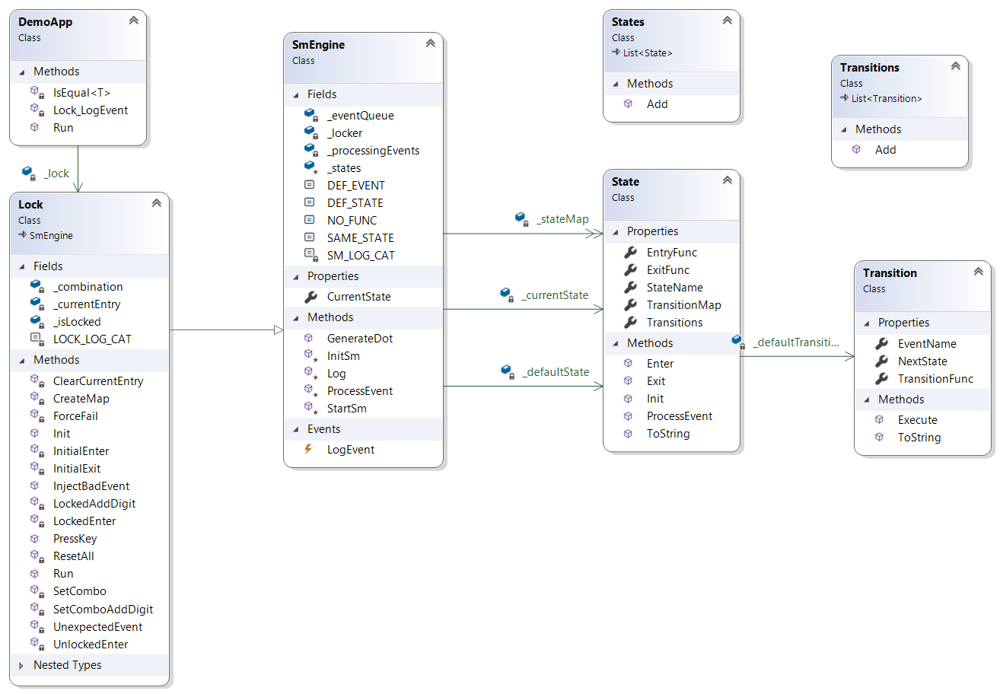

# NStateMachine
- Semi-hierarchical sparse state machine for .NET.
- Generates diagrams via dot.
- Targets .NET 5 and C# 9. No dependencies on third party components.
- System.Linq not used. Because it's too much like C++ templates.
- NStateMachine assembly is a standalone assembly.
- The Demo project is an example of how to use this and a unit test.


# Usage

The main idea is to shape the machine in a visually uncluttered fashion.


Define the states and events as standard enums:
```
public enum S { Default = 0, ThisState, OtherState, ... };
public enum E { Default = 0, Event2, Event3, ... };
```
The `Default = 0` is required to enable the sparse/hierarchal support.

Each state is described like this:
```
{ 
    ThisState, StateEntryFunc, StateExitFunc, new()
    {
        { Event1,       NextState,       Transition1Func },
        { Event2,       ThisState,       Transition2Func },
        { Default,      FailState,       HandleOtherEventsFunc }
    },
    ...
    Default, null, null, new()
    {
        { Shutdown,     Locked,          ResetAll },
        { Default,      Default,         UnexpectedEvent }
    }
},
```

- `ThisState` is an individual state.
- `StateEntryFunc` and `StateExitFunc` are option state entry/exit functions.
- `Event1` executes `Transition1Func` and state changes to `NextState`.
- If there is no match for a new event, the `Default` event transition is executed.
- If there is no match for a new event, and there is no `Default` transition, the `Default` state is used.


# Doc

## Diagram
You can generate a nice picture using graphviz if you have it installed (why would you not?).


## Classes

