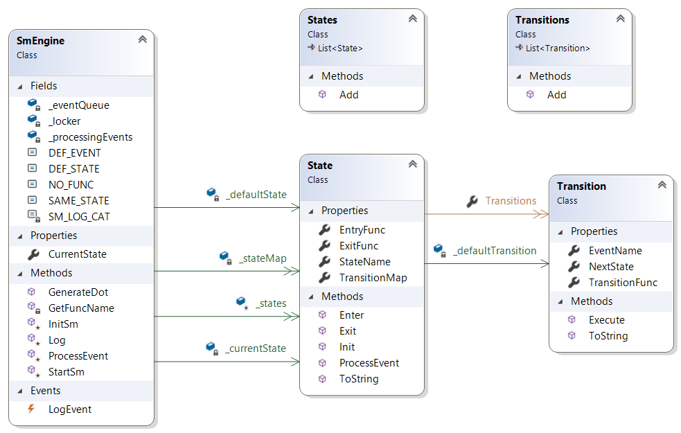

# NStateMachine
- Semi-hierarchical sparse state machine for .NET.
- Generates diagrams via dot.
- Targets .NET 5 and C# 9. No dependencies on third party components.
- System.Linq not used. Because it's too much like C++ templates.


# Usage
See Lock.cs and DemoApp.cs for an example of how to use this.

The main idea is to shape the machine in a visually uncluttered fashion. Each state would be described like this:
```
{ 
    MyState, OptionalEntryFunc, OptionalExitFunc, new()
    {
        { Event1,       NextState,       Transition1Func },
        { Event2,       NextState,       Transition2Func },
        { DEF_EVENT,    SAME_STATE,      HandleOtherEventsFunc }
    }
},
```

Here's part of Lock.cs:

```
_states = new()
{
    { 
        "Initial", InitialEnter, InitialExit, new()
        {
            { "IsLocked",       "Locked",       NO_FUNC },
            { "IsUnlocked",     "Unlocked",     NO_FUNC }
        }
    },
    {
        "Locked", LockedEnter, NO_FUNC, new()
        {
            { "ForceFail",       SAME_STATE,     ForceFail },
            { "DigitKeyPressed", SAME_STATE,     LockedAddDigit },
            { "Reset",           SAME_STATE,     ClearCurrentEntry },
            { "ValidCombo",      "Unlocked",     NO_FUNC },
        }
    },
    ....
};
```
State entry/exit and Transition functions are optional.

You can generate a nice picture using graphviz if you have it installed (why would you not?).


# Structure
More talk...


